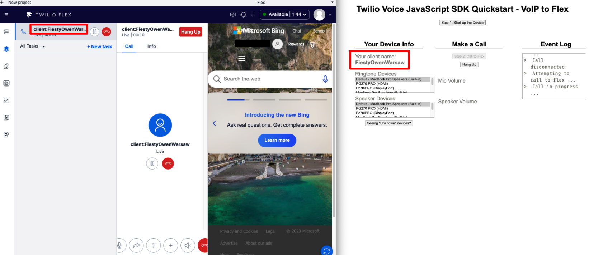
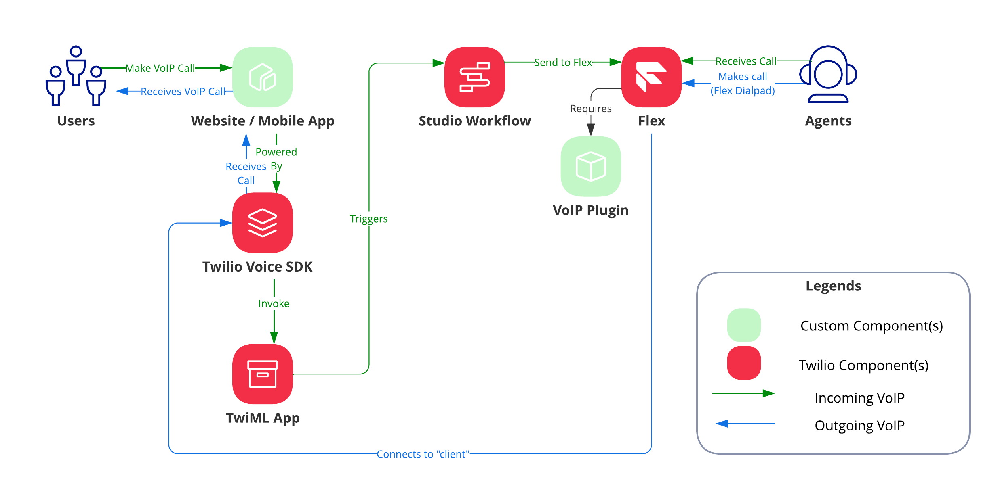
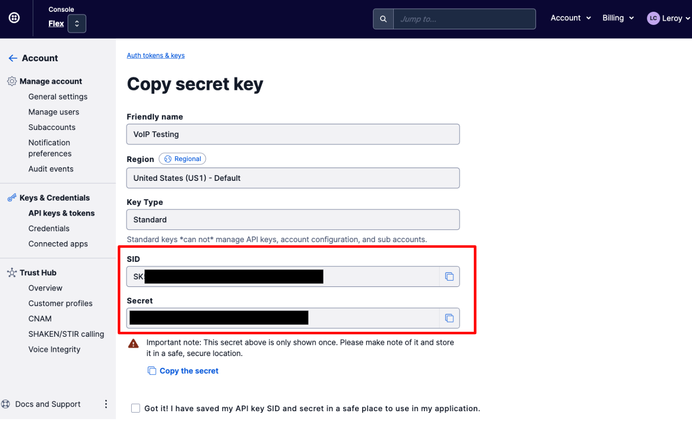
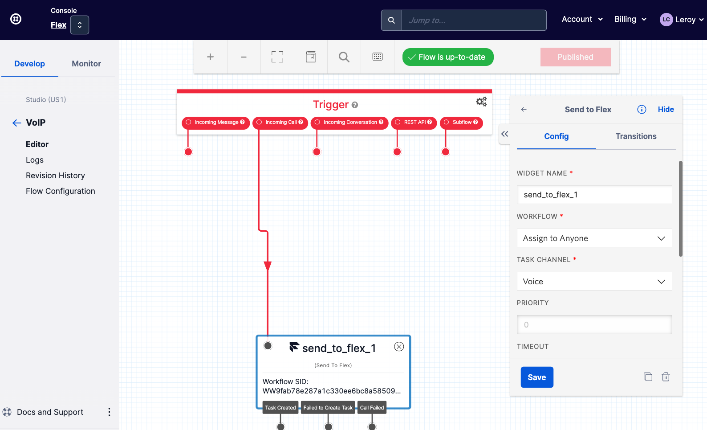
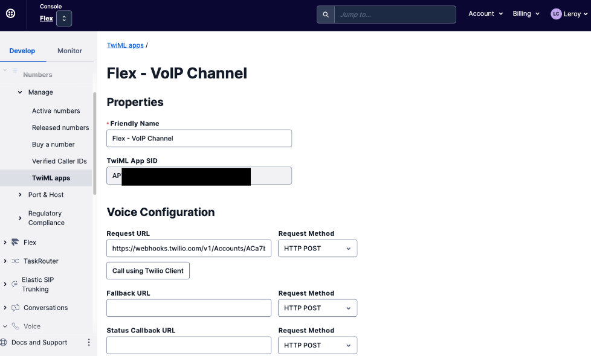
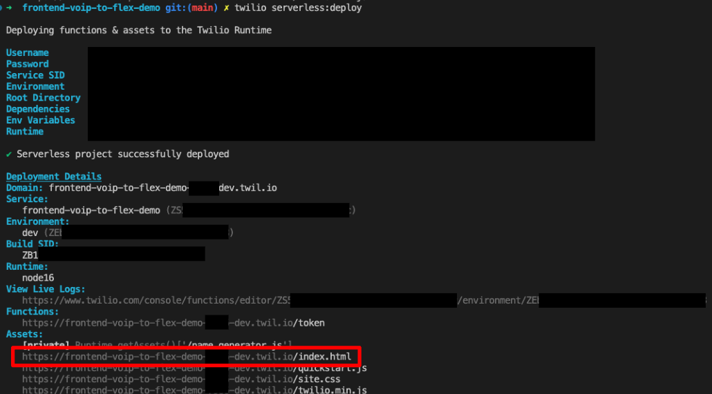

# Twilio Flex - VoIP Channel

_Twilio Flex - VoIP Channel_ allows you to leverage VoIP as a channel within Flex for both inbound and outbound calls.

The solution consist of 2 components:

1. `plugin-voip`: Twilio Flex plugin that allows agents to accept incoming VoIP calls and perform outbound VoIP calls to `client:` via the native Flex Dialpad
2. `frontend-voip-to-flex-demo`: Sample web interface that provides the ability to make and receive VoIP calls via Flex. Fully hosted on Twilio Functions.



## Supported Call Flows

1. Inbound VoIP - Client to Flex
2. Outbound VoIP - Flex to Client

---

## Solution



---

## Pre-requisites

1. Twilio Flex Account ([Guide](https://support.twilio.com/hc/en-us/articles/360020442333-Setup-a-Twilio-Flex-Account)) with Flex UI 2.x
2. Native Flex Dialpad enabled on Twilio Flex Account ([Guide](https://www.twilio.com/docs/flex/admin-guide/setup/voice/dialpad-configure))
3. Node.js v16.x.x ([Guide](https://docs.npmjs.com/downloading-and-installing-node-js-and-npm))
4. Twilio CLI v5.4.1 or above ([Guide](https://www.twilio.com/docs/twilio-cli/quickstart))
5. Twilio CLI Flex Plugin v6.0.4 or above ([Guide](https://www.twilio.com/docs/flex/developer/plugins/cli))
6. Twilio CLI Serverless Plugin v3.1.3 or above ([Guide](https://www.twilio.com/docs/labs/serverless-toolkit/getting-started))

---

## Getting Started

### Step 1: Create Twilio API Key and Secret

1. Login to [Twilio Console](https://console.twilio.com/) and copy down your `Account SID`.
2. Next, on the top right, select `Account` followed by `API keys & tokens`. Click on `Create API key`.
3. Enter `Flex - VoIP` for the Friendly name and leave everything as default.



Take note of your Account SID (`ACxxx`), API Key SID (starts with `SKxxxx`) and the secret - you will need it later in Step 4.

### Step 2: Create a Studio Workflow

1. Within [Twilio Console](https://console.twilio.com/) and under `Studio`, create a new Studio Flow.
2. Still within the Studio Flow, drag-and-drop the `Send to Flex` widget and configure the `Workflow` and `Task Channel` accordingly. For `Task Channel`, please choose `Voice`.
3. Once created, connect the `Incoming Call` trigger to `Send to Flex` widget and click `Publish`.

The Studio Flow should be configured similar to the screenshot below:



Take note of the Studio Flow SID which starts with `FWxxxxxxx`. You will need it for the next Step 3.

### Step 3: Create TwilML App

Within [Twilio Console](https://console.twilio.com/) and under `Voice`, select `TwiML Apps` which is under the `Manage` section. Click on `Create new TwiML App`.

You will only need to fill up the following:

1. Friendly name: `Flex - VoIP Channel`
2. Under Voice Configuration - Request URL: `https://webhooks.twilio.com/v1/Accounts/{{ACCOUNT_SID}}/Flows/{{FWxxxxxx}}`. Replace `{{ACCOUNT_SID}}` with your Flex Account SID (from Step 1) and `{{FWxxxx}}` with Studio Flow SID (from Step 2)

You can leave of the fields rest empty/default.



Take note of the TwiML App SID which starts with `APxxxxx`. You will need it for Step 4

### Step 4: Deploy Sample Web Interface for VoIP-to-Flex Demo

Before you proceed, make sure you have the following as you will need it to configure the `.env` file:

1. Twilio API Key (`SKxxxxxx`) - from Step 1
2. Twilio API Secret - from Step 1
3. TwiML App SID (`APxxxxx`) - from Step 3

On your terminal, perform the following:

```
// Clone Project
git clone https://github.com/leroychan/twilio-flex-voip.git

// Change to working directory
cd twilio-flex-voip

// Change to frontend-voip-to-flex-demo directory
cd frontend-voip-to-flex-demo

// Install NPM Packages
npm install

// Copy sample enviroment file
cp .env.example .env
```

Configure the `.env` file using your preferred code editor with all the required values. You can leave `ACCOUNT_SID=xxx` empty as it will be populated by default during run time.

Before you deploy, ensure that `twilio profiles:list` has an active account set.

Once configured and you are ready to deploy it, go back to your terminal and issue the following command:

```
twilio serverless:deploy
```

Once successfully deployed, visit the hosted `index.html` page to view your sample web interface to call/receive VoIP calls



### Step 5: Deploy Twilio Flex VoIP Plugin

On your terminal, perform the following:

```
// Clone Project
git clone https://github.com/leroychan/twilio-flex-voip.git

// Change to working directory
cd twilio-flex-voip

// Change to plugin-voip directory
cd plugin-voip

// Install NPM Packages
npm install

// Local Development
twilio flex:plugins:start

// Deploy to Twilio Flex Instance
// Before you deploy, ensure that `twilio profiles:list` has an active Flex account set.
twilio flex:plugins:deploy --changelog "Deploy VoIP Plugin"

twilio flex:plugins:release --plugin plugin-voip@0.0.1 --name "Deploy VoIP Plugin" --description "Allows agents to accept incoming VoIP calls and perform outbound VoIP calls"
```

### Step 6: Done !

Congratulations! You are now ready to start testing the VoIP channel integration.

#### Demo inbound VoIP call into Flex

1. Login to your Flex agent interface and set yourself to be of an `Available` status
2. On your browser, open the hosted web interface URL (from Step 4)
3. Click on `Step 1: Start up the Device` button. You should be seeing `Twilio.Device Ready to make and receive calls!` under the `Event log`
4. Click on `Step 2: Call to Flex`
5. You should be seeing the call coming into Flex !

#### Demo outbound VoIP call to client

1. On your Flex agent interface, click on the dialpad button
2. In the phone number field, input `client:<<CLIENT_NAME>>` and click call. `<<CLIENT_NAME>>` can be obtained under `Your Device Info` in your sample web interface.
3. The call should now be coming into your sample web interface

---

## License

MIT
