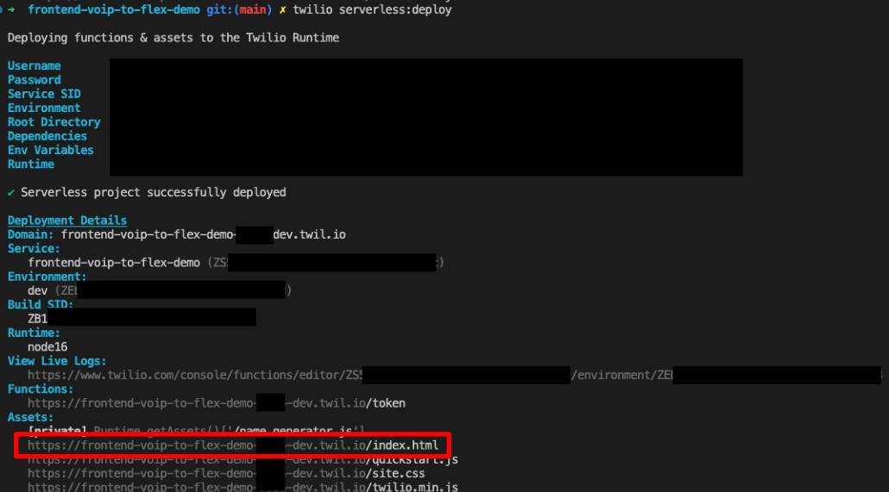

# Twilio Voice JavaScript SDK Quickstart - VoIP to Flex

A sample Twilio Voice Javascript SDK web interface that is hosted entirely on Twilio Functions. The web interface provides the ability to make and receive VoIP calls via Flex once the TwiML App has been configured.

_Note: This project is a fork of [Twilio Voice JavaScript SDK Quickstart](https://github.com/TwilioDevEd/voice-javascript-sdk-quickstart-node)_


---

## Pre-requisites

1. Twilio Flex Account ([Guide](https://support.twilio.com/hc/en-us/articles/360020442333-Setup-a-Twilio-Flex-Account))
2. Node.js v16.x.x only ([Guide](https://docs.npmjs.com/downloading-and-installing-node-js-and-npm))
3. Twilio CLI v5.4.1 or above ([Guide](https://www.twilio.com/docs/twilio-cli/quickstart))
4. Twilio CLI Serverless Plugin v3.1.3 or above ([Guide](https://www.twilio.com/docs/labs/serverless-toolkit/getting-started))
5. TwilML App Created ([Guide](https://support.twilio.com/hc/en-us/articles/223180928-How-Do-I-Create-a-TwiML-App-))
6. Twilio API Key & API Secret ([Guide](https://support.twilio.com/hc/en-us/articles/9318455807771-API-Keys-and-How-to-Change-Them))

---

## Getting Started

You will need the following before proceeding

1. TwiML App SID
2. Twilio API Key
3. Twilio API Secret

On your terminal, perform the following:

```
// Clone Project
git clone https://github.com/leroychan/twilio-flex-voip.git

// Change to working directory
cd twilio-flex-voip

// Change to frontend-voip-to-flex-demo directory
cd frontend-voip-to-flex-demo

// Install NPM Packages
npm install

// Copy sample enviroment file
cp .env.example .env
```

Configure the `.env` file using your preferred code editor with all the required values. You can leave `ACCOUNT_SID=xxx` empty as it will be populated by default during run time.

Before you deploy, ensure that `twilio profiles:list` has an active account set.

Once configured and you are ready to deploy it, go back to your terminal and issue the following command:

```
twilio serverless:deploy
```

Once successfully deployed, visit the hosted `index.html` page to view your sample web interface to call/receive VoIP calls



---

## Developing VoIP Calls for Mobile Apps

This sample web interface is built using [Twilio Voice SDK for Javascript](https://www.twilio.com/docs/voice/sdks/javascript/get-started).

Using the same methodology and logic, you can leverage Twilio Voice SDKs for native mobile applications to build out similar VoIP use cases.

1. [Twilio Voice iOS SDK](https://www.twilio.com/docs/voice/sdks/ios)
2. [Twilio Voice Android SDK](https://www.twilio.com/docs/voice/sdks/android)

---

## License

MIT
